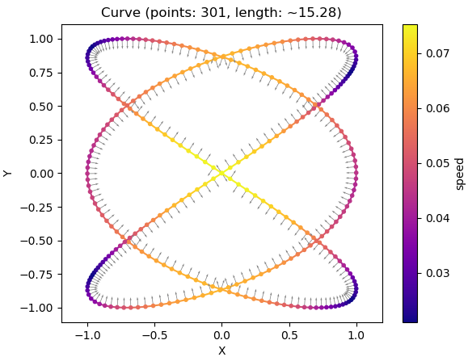
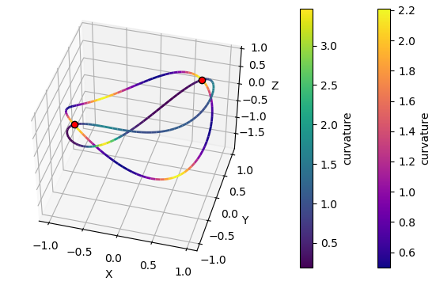

# scikit-curve

[](https://pypi.python.org/pypi/scikit-curve)

[](https://github.com/espdev/scikit-curve/blob/master/LICENSE)
[](https://coveralls.io/github/espdev/scikit-curve?branch=master)
[](https://travis-ci.org/espdev/scikit-curve)
[](https://scikit-curve.readthedocs.io/en/latest/)

:warning: :construction: **UNDER DEVELOPMENT** :construction:  :warning:

A toolkit to manipulate n-dimensional geometric curves in Python.

## Examples

```python
import matplotlib.pyplot as plt

from curve.curves import lissajous
from curve.plot import curveplot
from curve import PreservedSpeedInterpolationGrid

curve = lissajous(p_count=51)

grid = PreservedSpeedInterpolationGrid(301)
curve_i = curve.interpolate(grid, method='hermite')

curveplot(curve_i, param='speed', show_normals=True, marker='.')

plt.show()
```



```python
import numpy as np
import matplotlib.pyplot as plt

from curve import Curve, Axis
from curve.plot import curveplot

t = np.linspace(0, 2*np.pi, 100)

x = np.cos(t)
y = np.sin(t)
z1 = x * y
z2 = x - y + z1

curve1 = Curve([x, y, z1])
curve2 = Curve([x, y, z2])

intersections = curve1.intersect(curve2)

ax = curveplot(curve1, param='curvature', linewidth=2).\
     curveplot(curve2, param='curvature', param_cmap='viridis', linewidth=2).axes

ix = []
iy = []
iz = []

for intersect in intersections:
    p = intersect.intersect_point
    print('Intersect:', p)

    ix.append(p[Axis.X])
    iy.append(p[Axis.Y])
    iz.append(p[Axis.Z])

ax.plot(ix, iy, iz, 'o', markerfacecolor='r', markeredgecolor='k', zorder=1000)

ax.set_title('')
plt.show()
```

```
Intersect: Point([0.7068 0.7068 0.4991], ndim=3, dtype=float64)
Intersect: Point([-0.707  -0.707   0.4996], ndim=3, dtype=float64)
```


